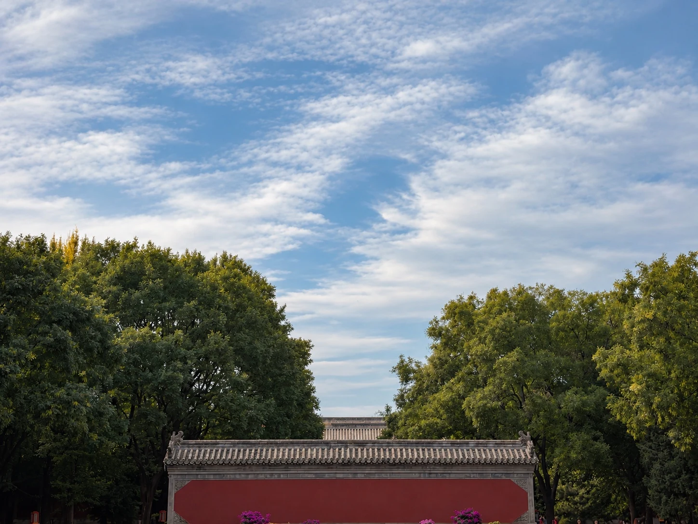
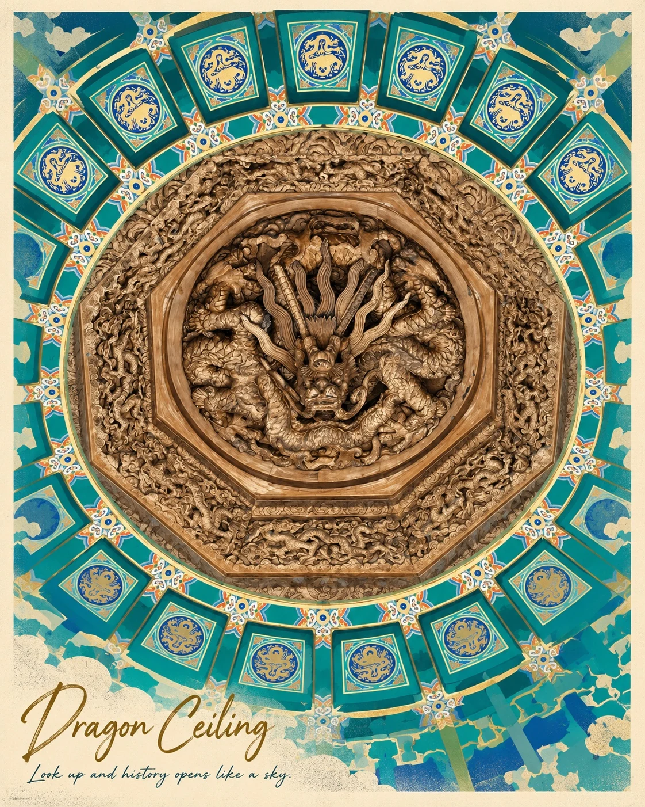
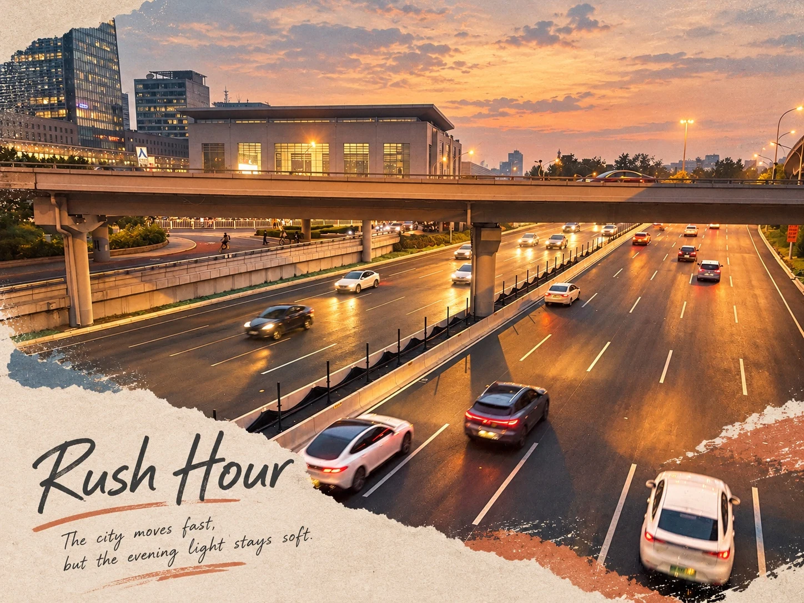
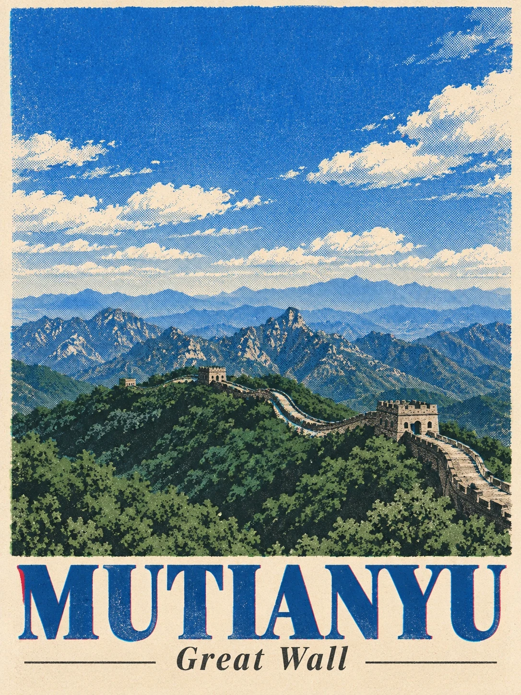
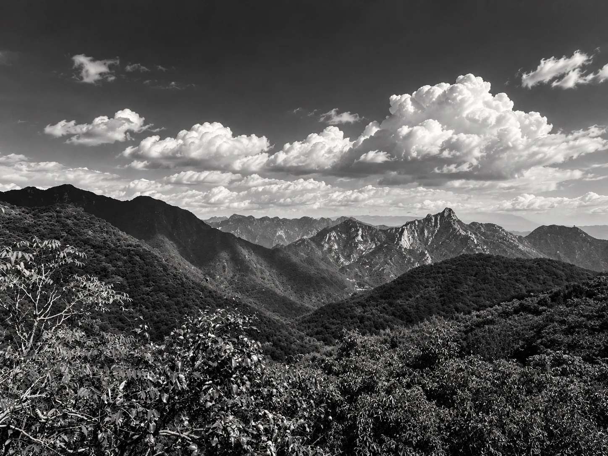
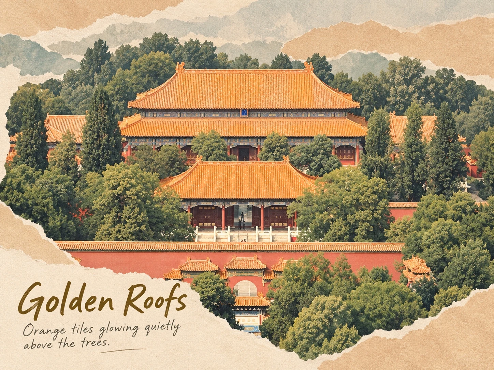
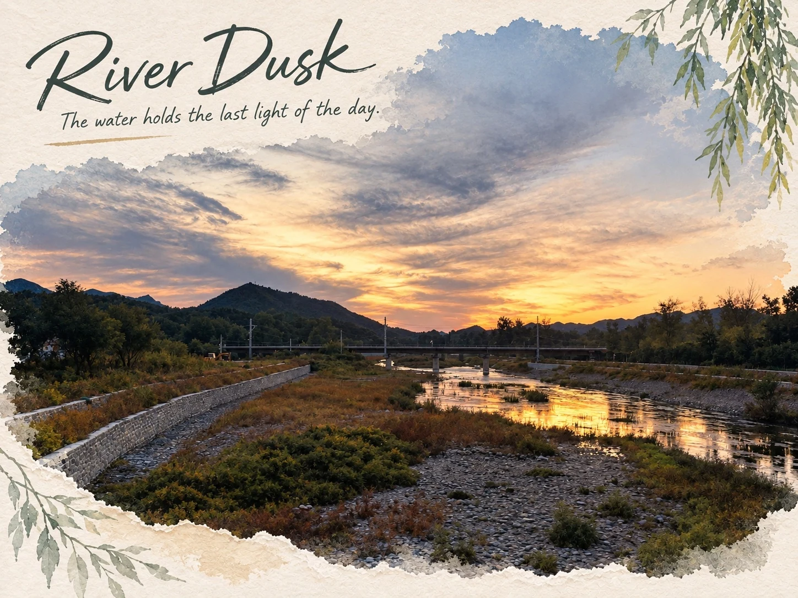

# Photo Skills — ABC 用户版（R9）

一套**真实照片后期与设计表达**的 AI Agent 技能包（Skills）。三个模块职责独立、协同运行，共享同一套路由与交付契约。**本版默认：正常底片处理 + 重 B。**

用户把照片交给本包并要求处理、修图、做成品时，**不需要等用户说出「杂志 / 拼贴 / 加字」才开启 B**：场景主角默认 **A + B**（正常 A + 重 B），人物主角默认 **C + B**（正常 C + 重 B），**不串联 A + C**。统一入口是根目录 [`SKILL.md`](SKILL.md)（技能名 `photo-skills-abc-user`）；例外与强度规则见 [`ROUTING.md`](ROUTING.md)。

## 参考图库预览

技能包内置参考图库（reference-library）：**A 组 = 真实摄影后期方向**（环境光一致、层次与真实感），**B 组 = Photo Zine / 编辑设计方向**（留白、版式、纸张与印刷语言）。以下为部分精选，完整 **45 张**（含反例对照）见 [`GALLERY.md`](GALLERY.md)。

<table>
<tr><td align="center" width="33%"><br><sub>A · River Dusk</sub></td><td align="center" width="33%"><br><sub>A · Lake Boats</sub></td><td align="center" width="33%"><br><sub>A · Red Wall Soft Sky</sub></td></tr>
<tr><td align="center" width="33%"><br><sub>B · Dragon Ceiling</sub></td><td align="center" width="33%"><br><sub>B · Rush Hour</sub></td><td align="center" width="33%"><br><sub>B · Retro Halftone Poster</sub></td></tr>
<tr><td align="center" width="33%"><br><sub>B · High Contrast B&amp;W</sub></td><td align="center" width="33%"><br><sub>B · Golden Roofs</sub></td><td align="center" width="33%"><br><sub>B · River Dusk</sub></td></tr>
</table>

> 参考图是技能运行时的风格与质量参照（visual-memory assets），不是可复制的模板。全库无 EXIF，已通过公开上传审查（见 [`PUBLIC_ASSET_REVIEW.md`](PUBLIC_ASSET_REVIEW.md)）。

## 模块与职责

| 模块 | 目录 | 版本 | 职责 |
|---|---|---|---|
| **A — Scene Real Grade** | [`A-photo-real-grade-v1.3.1/`](A-photo-real-grade-v1.3.1/) | 1.3.1 | 正常场景真实底片处理：曝光、白平衡、局部明暗、色彩层次、环境光线一致性；**原有后期权重保留**，不为平衡重 B 而加强调色 |
| **B — Photo Zine / Editorial** | [`B-photo-zine-v5.4.0/`](B-photo-zine-v5.4.0/) | 5.4.0 | 默认**重 B**：可见的页面构图 + 第二个有功能的叙事 / 视觉层级；把照片重绘程度与页面设计强度拆成两件独立的事 |
| **C — Portrait Real Grade** | [`C-portrait-real-grade-v1.1.1/`](C-portrait-real-grade-v1.1.1/) | 1.1.1 | 正常人像底片，以及明确授权下的局部修整；头发、瘦身等附加要求是**附加授权**，不替代 C，也不关闭 B |

## 默认路由（R9）

| 当前任务 | 场景主角 | 人物主角 | 底片强度 | B 强度 |
|---|---|---|---|---|
| 按本包处理、修图、做成品；未限制设计 | **A+B** | **C+B** | normal | strong |
| 只调色、只真实后期、明确不要设计 | A | C | normal | off |
| 明确轻 B / 少做设计 | A+B | C+B | normal | light |
| 明确普通设计强度 | A+B | C+B | normal | standard |
| 只设计、不做底片调色 | B | B | none | strong（除非另有明确强度） |
| 分析、点评、诊断、返回方案 | analysis-only | analysis-only | 不生成 | 不生成 |

- 背影、夜间全身、环境人像仍属**人物主角**；场景中的小行人通常属场景主角。**人物主角禁止 A + C 串联**（C 本身包含环境处理）。
- 「头发顺一点、身材苗条一点、保持自然」是 **C 的附加授权**：正常 C + 自然的局部修整 + 重 B；锁定人物身份、姿态、服装与光线，不为排版重造人物。
- 明确「只调色 / 只修人像 / 不要设计 / 轻 B / 只分析」时按例外执行；「自然、克制、保留原片」约束的是**照片真实性**，**不能自行解释成取消 B**。

### 关键不变量：照片重绘程度与设计强度分离

- **`PRESERVE + T0 + strong B` 是合法组合。** 照片越好，越应该保护它，而不是取消设计。
- 弱候选、低置信度、原片已经很好 → 降低重绘风险与装饰噪声，**保持已锁定的 B 强度**；重 B 可以是干净有力的 editorial 页面，不强制拼贴、文字或多图。
- A/C 的「保持构图 / 禁止排版 / 禁止纸张与文字」约束的是**照片区域（底片）**，不是 B 的最终画布。
- 底片完成只记 `base_done`；**只能交付底片时必须标明「底片已完成，B 未完成」**，不得冒充全部成品；工具失败或额度不足如实记 `blocked`。

详细字段、重 B 标准、失败回退与完成判据见 [`B-photo-zine-v5.4.0/references/delivery-contract.md`](B-photo-zine-v5.4.0/references/delivery-contract.md)；反馈吸收机制见 [`FEEDBACK_ABSORPTION_POLICY.md`](FEEDBACK_ABSORPTION_POLICY.md)。

## 稳定基线

1. 用户通常对原片已经满意；默认不是把照片改得更厉害，而是避免 P 过、AI 味、滤镜味。
2. 正常底片 = **既有真实后期流程**本身，不是为平衡重 B 而加强的调色。
3. 重 B 通过**页面构图与功能层级**实现，不靠堆贴纸、固定拼贴模板或夸张调色。
4. 新知识扩充工具箱，不自动改变默认审美或模块权重。
5. 批次处理不为了省事合并照片，也不靠固定风格配额制造多样性。
6. 九宫格 / 网格照片墙只是末尾硬失败检查，不参与主风格决策。

## 仓库结构

```
├── SKILL.md                        # 统一入口技能（photo-skills-abc-user）
├── ROUTING.md                      # 路由规则：正常底片 + 重 B（R9）
├── README.md / INSTALL.md / USAGE.md
├── GALLERY.md                      # 参考图库总览（45 张，含反例对照）
├── CHANGELOG.md                    # 版本历史
├── FEEDBACK_ABSORPTION_POLICY.md   # 反馈吸收机制（v1.1）
├── PUBLIC_ASSET_REVIEW.md          # 参考图库公开上传审查说明
├── QC_SUMMARY.md / qc/             # 本版验证结果与仓库文件清单（MANIFEST / SHA256SUMS）
├── A-photo-real-grade-v1.3.1/      # 模块 A（SKILL.md / references / reference-library / qc）
├── B-photo-zine-v5.4.0/            # 模块 B（SKILL.md / references / reference-library / qc）
├── C-portrait-real-grade-v1.1.1/   # 模块 C（references；无公开参考图）
├── quickstart/                     # 聊天 AI 粘贴版提示词
├── audits/                         # R6–R9 审计与机器质检记录
└── golden-backup/                  # 原始 B V5.3 黄金备份（不可变，不参与运行）
```

## 快速开始（怎么用）

**① 给 AI Agent 的一句话安装（推荐）** —— 把这句话发给你的 agent（Claude Code / Codex / Cursor 等），它会拉取安装说明并自己装好：
> `curl -fsSL https://raw.githubusercontent.com/tuozhekongqi/photo-skills/main/INSTALL.md`，然后按该文件的说明把 Photo Skills（ABC 用户版）安装为你的技能；装好后读根目录 `SKILL.md` 与 `ROUTING.md` 并开始使用。
>
> （国内网络如打不开 raw.githubusercontent.com，把链接换成 jsDelivr 镜像：`https://cdn.jsdelivr.net/gh/tuozhekongqi/photo-skills@main/INSTALL.md`）

**② 聊天 AI 粘贴用法** —— 下载 [`quickstart/快速版提示词.md`](quickstart/快速版提示词.md)（或 Release 附件），整段粘贴给豆包 / DeepSeek 等，再发照片。默认：场景正常 A + 重 B，人物正常 C + 重 B；说「只调色 / 不要设计 / 轻 B」可改变设计强度。

**③ 开发者** —— 入口顺序：根 `SKILL.md` → `ROUTING.md` → 模块 `SKILL.md` → `references/`。

详细步骤（含手动安装命令与分享话术）见 [`USAGE.md`](USAGE.md)。

## 版本

- 当前稳定版：**R9 — ABC 用户版 v1.0 分发包**（模块版本 A `1.3.1` · B `5.4.0` · C `1.1.1`）。
- R9 相对 R8 的主要变化：默认路由由「无人像 A+B / 有人像 A+B+C」改为「场景正常 A + 重 B / 人物正常 C + 重 B」，并把**照片重绘程度（T0–T3 / PRESERVE）与页面设计强度（design_strength）**拆成两个独立字段；新增交付契约（`delivery-contract.md`）、完成判据与回归案例。详见 [`CHANGELOG.md`](CHANGELOG.md) 与 `audits/`。
- `golden-backup/`：原始 B V5.3 黄金备份，字节级保留，不参与运行、不允许覆盖。
- `qc/` 清单覆盖本仓库全部文件（仅排除 `qc/MANIFEST.csv` 与 `qc/SHA256SUMS.txt` 自身）；分发包 zip 内自带其自身的 qc 清单与哈希。

## 素材说明

公开参考图库共 **45 张**（A 10 张；B 35 张 = 正向 34 + 反例 1）。个别素材已移出公开范围，原因与清单见 [`PUBLIC_ASSET_REVIEW.md`](PUBLIC_ASSET_REVIEW.md)。

## 许可说明

本仓库暂未附带开源许可证（保留所有权利）。未经明确许可，**不得将本仓库内容用于商业用途**。
